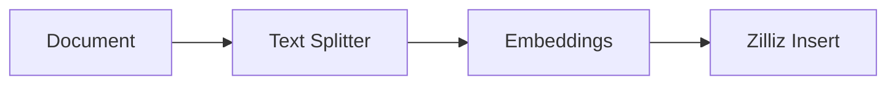
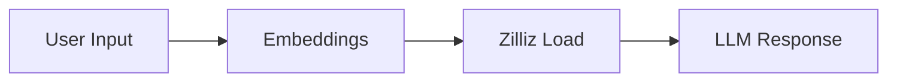

# n8n-nodes-zilliz 使用指南

## 概述

n8n-nodes-zilliz 是一个用于连接 Zilliz Cloud 向量数据库的 n8n 社区节点包。它专为 AI Agent 和 RAG（检索增强生成）应用而设计，提供完整的向量数据库操作功能。

## 安装

### 1. 在 n8n 中安装社区节点

如果您使用 n8n 云版本或自托管版本：

1. 进入 n8n 设置
2. 选择 "Community Nodes"
3. 点击 "Install a community node"
4. 输入: `n8n-nodes-zilliz`
5. 点击安装

### 2. 本地开发安装

```bash
npm install n8n-nodes-zilliz
```

## 配置凭证

### 获取 Zilliz Cloud 凭证

1. 注册 [Zilliz Cloud 账号](https://cloud.zilliz.com.cn/signup)
2. 创建一个集群
3. 获取以下信息：
   - **API Key**: 在控制台的 "API Keys" 页面生成
   - **Cluster Endpoint**: 从集群详情页面复制，格式如 `https://your-cluster-id.api.region.zillizcloud.com`

### 在 n8n 中配置凭证

1. 在 n8n 中点击 "Credentials"
2. 点击 "Add Credential"
3. 搜索并选择 "Zilliz Cloud API"
4. 填入获取的凭证信息：
   - **API Key**: 您的 Zilliz API 密钥
   - **Cluster Endpoint**: 您的集群端点 URL

## 节点说明

### 1. Zilliz Vector Store

**功能**: 基础向量数据库操作节点

**操作类型**:
- **Search Vectors**: 相似度搜索
- **List Collections**: 列出所有集合

**配置参数**:
- **Database Name**: 数据库名称（默认: default）
- **Collection Name**: 集合名称
- **Query Vector**: 搜索向量（JSON数组格式）
- **Limit**: 返回结果数量
- **Filter Expression**: 过滤条件

**示例用法**:
```json
{
  "operation": "search",
  "zillizDatabase": "default",
  "zillizCollection": "documents",
  "queryVector": "[0.1, 0.2, 0.3, 0.4, 0.5]",
  "limit": 10,
  "filter": "category == 'technology'"
}
```

### 2. Zilliz Vector Store Insert

**功能**: 向量数据插入节点

**配置参数**:
- **Database Name**: 数据库名称
- **Collection Name**: 集合名称
- **Options**:
  - **Clear Collection**: 插入前清空集合
  - **Text Field**: 文本字段名称（默认: text）
  - **Vector Field**: 向量字段名称（默认: vector）
  - **Metadata Fields**: 元数据字段（逗号分隔）

**输入数据格式**:
```json
{
  "vector": [0.1, 0.2, 0.3, 0.4, 0.5],
  "text": "这是一段示例文本",
  "category": "技术",
  "source": "文档A"
}
```

### 3. Zilliz Vector Store Load

**功能**: 向量搜索和加载节点

**配置参数**:
- **Database Name**: 数据库名称
- **Collection Name**: 集合名称
- **Query Vector**: 查询向量或字段引用
- **Top K**: 返回结果数量
- **Options**:
  - **Filter Expression**: 过滤条件
  - **Output Fields**: 输出字段
  - **Score Threshold**: 相似度阈值

**查询向量格式**:
```json
// 直接使用数组
[0.1, 0.2, 0.3, 0.4, 0.5]

// 或使用字段引用
{{$json.embedding}}
```

## 典型使用场景

### 场景1: 文档知识库构建

**工作流**: Document → Text Splitter → Embeddings → Zilliz Insert

1. **Document 节点**: 读取文档内容
2. **Text Splitter**: 将文档分割成块
3. **Embeddings 节点**: 生成向量嵌入
4. **Zilliz Insert**: 存储到向量数据库



### 场景2: 智能问答系统

**工作流**: User Input → Embeddings → Zilliz Load → LLM

1. **用户输入**: 接收问题
2. **Embeddings**: 将问题转换为向量
3. **Zilliz Load**: 搜索相关文档
4. **LLM**: 基于检索内容生成回答



### 场景3: 语义搜索API

**工作流**: HTTP Request → Embeddings → Zilliz Load → HTTP Response

1. **HTTP Request**: 接收搜索请求
2. **Embeddings**: 生成查询向量
3. **Zilliz Load**: 执行相似度搜索
4. **HTTP Response**: 返回搜索结果

## 高级特性

### 过滤表达式

支持复杂的过滤条件：

```javascript
// 数值过滤
"score > 0.8"
"id >= 100 and id < 1000"

// 字符串过滤
"category == 'technology'"
"author in ['Alice', 'Bob']"

// 组合过滤
"score > 0.7 and category == 'tech' and source != 'old_data'"

// 元数据过滤
"$meta['custom_field'] == 'value'"
```

### 批量处理

节点支持批量处理，可以在单个执行中处理多个输入项。

### 错误处理

- 启用 "Continue on Fail" 选项来处理部分失败
- 检查返回的错误信息进行调试

## 故障排除

### 常见问题

1. **连接错误**
   - 检查 API 密钥是否正确
   - 验证集群端点 URL 格式
   - 确认网络连接正常

2. **集合不存在**
   - 使用 "List Collections" 操作验证集合名称
   - 确保集合已在 Zilliz Cloud 中创建

3. **向量维度不匹配**
   - 确认输入向量维度与集合定义一致
   - 检查 embeddings 模型输出维度

4. **权限错误**
   - 确认 API 密钥具有足够权限
   - 检查集群访问策略设置

### 调试技巧

1. **启用 Continue on Fail**: 查看详细错误信息
2. **使用 List Collections**: 验证连接和权限
3. **检查数据格式**: 确保输入数据符合期望格式
4. **逐步测试**: 先测试简单操作，再进行复杂查询

## 性能优化

### 最佳实践

1. **合理设置 Limit**: 避免返回过多结果
2. **使用过滤条件**: 缩小搜索范围
3. **批量插入**: 一次插入多条记录
4. **索引优化**: 在 Zilliz Cloud 中合理配置索引

### 监控指标

- 查询响应时间
- 搜索准确率
- 存储使用量
- API 请求频率

## 版本更新

查看 [CHANGELOG.md](./CHANGELOG.md) 了解版本更新信息。

## 贡献

欢迎提交 Issue 和 Pull Request！

## 许可证

MIT License

## 相关资源

- [Zilliz Cloud 官网](https://zilliz.com.cn/cloud)
- [Zilliz API 文档](https://docs.zilliz.com.cn/reference/restful)
- [n8n 官方文档](https://docs.n8n.io/)
- [项目 GitHub 仓库](https://github.com/QixYuanmeng/n8n-nodes-zilliz)
